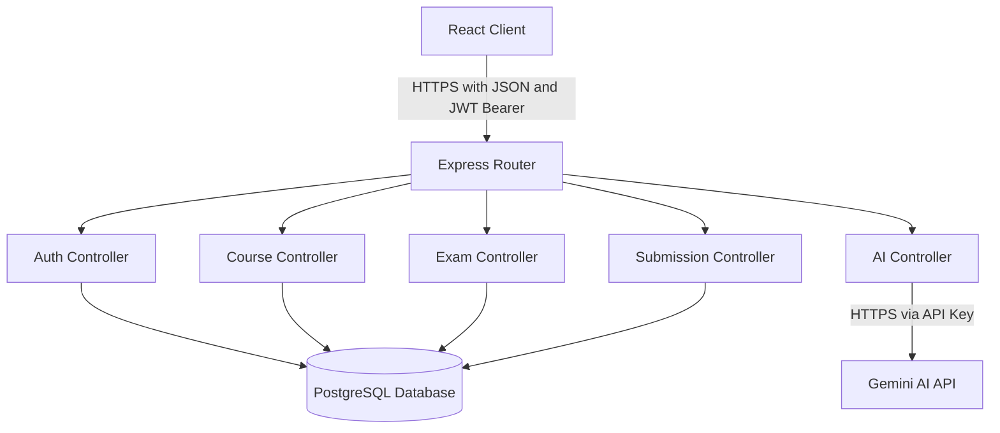
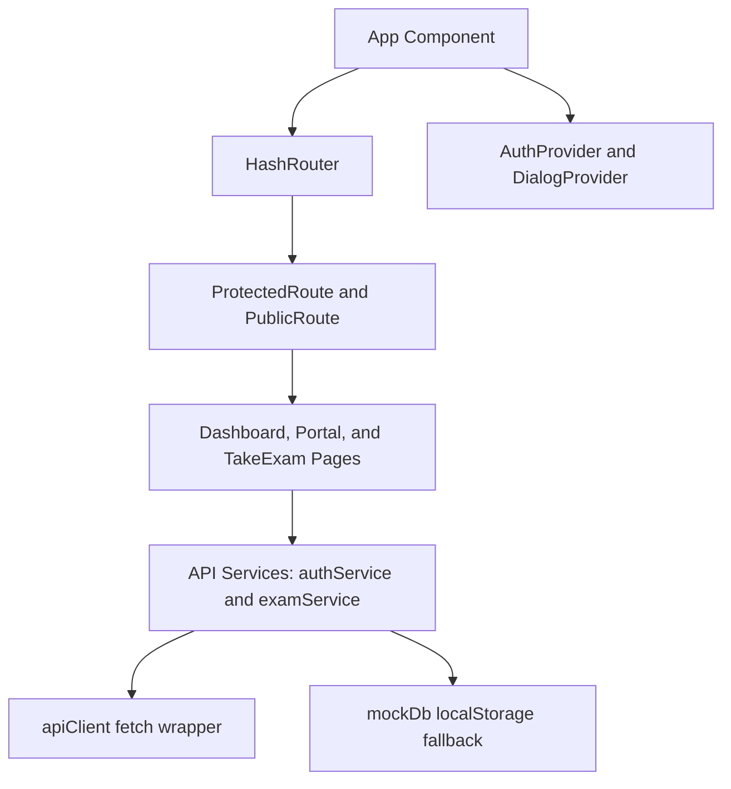
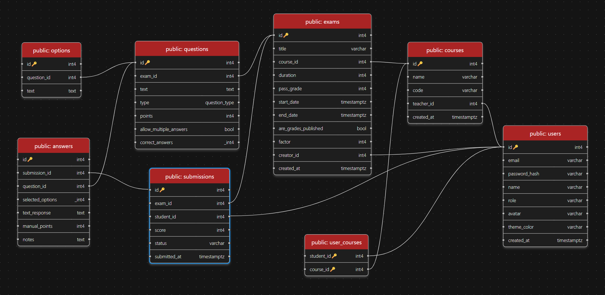
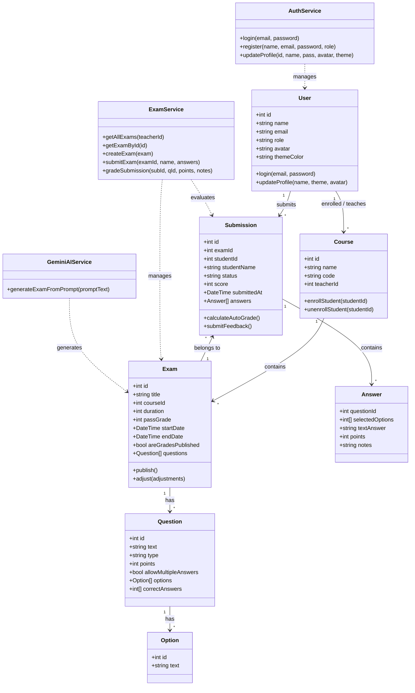
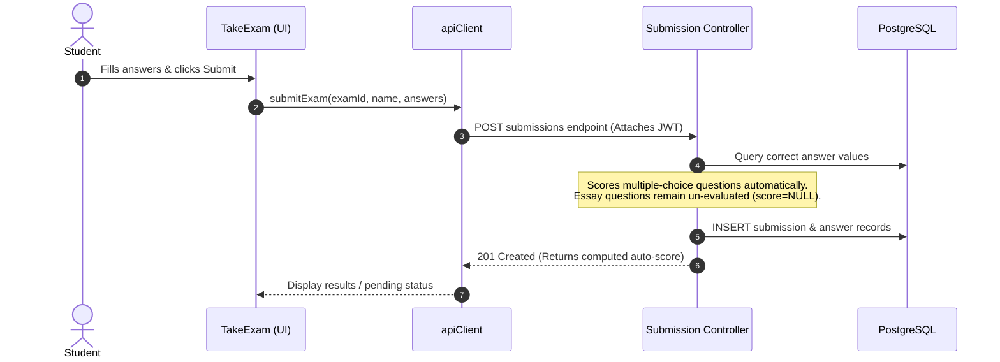
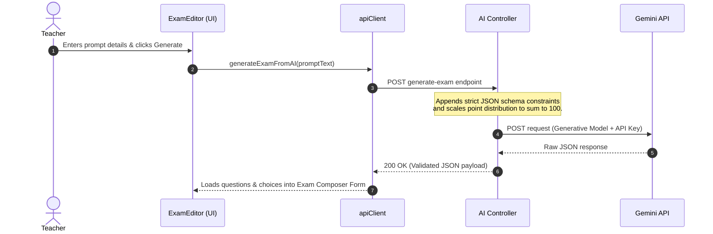

# 🎓 Full-Stack Exam Management System (LMS)

A robust, enterprise-grade Learning Management System (LMS) built to facilitate secure, timed exam creation, dynamic taking, and comprehensive grading workflows.

[](https://react.dev/)
[](https://nodejs.org/)
[](https://expressjs.com/)
[](https://www.postgresql.org/)
[](https://vite.dev/)
[](https://jwt.io/)

---

## 🌐 Live Deployments

- [Github Pages Deployment](https://nashd31.github.io/ExamApp/)
- [Render Deployment](https://examapp-2k27.onrender.com)

---

## ✨ Key Features

### 👨‍🏫 Teacher Dashboard
* **Course Administration:** Create new courses, generate unique enrollment codes, and manage active student registries.
* **AI Exam Architect:** Instantly generate a complete, balanced set of exam questions (points distributed to exactly 100) using a natural language prompt (e.g., "create a JavaScript closures exam with 5 multiple choice and 3 open ended") powered by Gemini AI.
* **Exam Composer:** Build detailed assessments containing multiple-choice questions (supporting both single and multi-select answers) or open-ended essay questions.
* **Assessment Controls:** Configure strict time limits (duration in minutes), set minimum passing criteria, and schedule release windows.
* **Manual & Auto Grading:** Auto-grade multiple-choice responses instantaneously. Grade open-ended answers manually with custom scores and detailed text comments.
* **Grade Release Control:** Keep exam scores hidden until grading is fully finalized, then publish all grades with a single click.
* **Analytics Center:** View class statistics, average scores, pass/fail ratios, and grade distribution charts.

### 🧑‍🎓 Student Portal
* **Course Enrollment:** Search and join courses using unique codes provided by teachers.
* **Focused Exam Environment:** Sit for exams in a distraction-free layout featuring a live, persistent countdown timer.
* **Auto-Submission Safeguard:** Automatically saves and submits exam progress if the countdown timer expires.
* **Detailed Feedback & History:** Browse all completed exams, view grades, review correct answers, and read teacher feedback notes.

### 🛡 Security & Customization
* **JWT-Based Authentication:** Clean state management and route security handled on both frontend route guards and backend middleware.
* **Role-Based Routing:** Strict segregation between Student and Teacher privileges.
* **Custom Profile Themes:** Personalize user experiences with custom avatar pickers and responsive UI color themes.

---

## 🚀 Production Highlights
* **🤖 AI Exam Architect (Gemini AI Integration):** Empowers teachers to draft custom exam content instantaneously using raw natural language prompts (e.g., "create a CSS layouts test with 3 multiple choice and 2 essay questions"). Our backend routes these queries to Gemini, returning structured schemas with points balanced precisely to a 100-point total.
* **🔁 Automated CI/CD Pipelines:** Outfitted with an automated GitHub Actions workflow that executes validation tests, verifies project builds, and compiles + publishes production builds to **GitHub Pages** seamlessly upon every merge or push to the `main` branch.

---

## 🏗 System Architecture

The project implements a decoupled client-server architecture. The React frontend interacts with the Node.js/Express backend through a secure RESTful API, with PostgreSQL acting as the central database.



### 📡 High-Level Architectural Flow
* **Communication:** The frontend communicates with the server via stateless RESTful API routes using `JSON` payloads.
* **Authentication:** Handled using **JSON Web Tokens (JWT)**. On login, the client receives a token and caches it in `localStorage` via `storage.js`. It is attached to all subsequent request headers as `Authorization: Bearer <JWT>`.
* **Data Storage:** Persistent data is stored in PostgreSQL. If the offline mode is enabled (`USE_SERVER_API: false`), the frontend falls back to `mockDb.js` simulating database tables in `localStorage`.
* **AI Service:** The client sends natural-language prompts to the backend. The backend resolves the request using Google's Gemini SDK (`@google/generative-ai`) and returns point-balanced exam objects.

---

## 💻 Client-Side Architecture

The frontend is a single-page application built on Vite, React, and Bootstrap.



### 🌳 Component Hierarchy
```
main.jsx
└── App.jsx
    ├── HashRouter (Routing Engine)
    ├── ScrollToTop
    ├── AuthProvider (Auth State Context)
    │   └── DialogProvider (Global Modal Context)
    │       └── AppContent (Layout container)
    │           ├── Navbar.jsx (Sticky Global Header)
    │           │   └── SettingsModal.jsx (Avatar & Theme customization)
    │           └── Main Workspace Pages (Inside Routes):
    │               ├── Home.jsx (Static Landing Dashboard)
    │               ├── PrivacyPolicy.jsx (Static Legal Document)
    │               ├── TermsAndConditions.jsx (Static Legal Document)
    │               ├── Auth.jsx (Unified Login / Registration Screen) [Guarded by PublicRoute]
    │               ├── StudentPortal.jsx (Student Dashboard) [Guarded by ProtectedRoute]
    │               ├── TakeExam.jsx (Timed Exam Workspace) [Guarded by ProtectedRoute]
    │               └── TeacherDashboard.jsx (Teacher Management Suite) [Guarded by ProtectedRoute]
    │                   ├── ExamEditor.jsx (Exam Creation with Gemini AI Assistant)
    │                   ├── ExamScoresViewer.jsx (Student Grades List & Performance Charts)
    │                   ├── GradeSubmissionViewer.jsx (Manual Grading & Feedback Workspace)
    │                   ├── ExamAdjustment.jsx (Exam Timers / Passing Grades / Factors Adjuster)
    │                   └── CustomDateTimePicker.jsx (Release & Expiration Validators)
```

### 🔑 Core Client Modules
* `HashRouter`: Binds hash routing (`/#/path`) to bypass routing fallback errors on static page hosts like GitHub Pages.
* `ProtectedRoute.jsx` & `PublicRoute.jsx`: Dynamic route guards implementing role authorization.
* `AuthProvider`: Propagates active user data, profile/avatar modifiers, and the `applyTheme` module targeting CSS variables (`--theme-color`).
* `DialogProvider`: imperative Promise-based alert/confirm dialog manager. Connects to the decoupled notification system in `notify.js` using browser custom DOM events.
* **Dependencies:** Configured in `client/package.json` containing `react`, `react-dom`, `react-router-dom`, `bootstrap`. Dev dependencies include `vite`, `vitest`, `gh-pages`, `jsdom`, and `@testing-library/react`.

---

## 🖥 Server-Side Architecture

The backend server is structured under the MVC (Model-View-Controller) design pattern.

### 🗺 MVC Architecture Pattern
The backend is designed following the **Model-View-Controller (MVC)** architectural design pattern:
1. **Model:** Represented by the PostgreSQL relational database schema. Database structures and queries are run via SQL DDL transactions compiled through a centralized connection pool.
2. **View:** Represented by the React client application. The server serves JSON data payloads, completely decoupling the server logic from the rendering pipeline.
3. **Controller:** Represented by controller modules in the `server/controllers/` directory which handle input validation, authenticate scopes, run business processes, and respond to requests.

### ⚙ Controller-Routing Execution Pipeline
1. **Router:** Incoming API requests hit `server.js` and are mapped to routing folders (e.g. `server/routes/`).
2. **Middleware:** Custom authorization middlewares (e.g. `authMiddleware.js`) parse headers to decode JWT tokens, block unauthorized access, and attach user metadata.
3. **Controller:** The request is processed by controllers (e.g. `examController.js`) which interact with the database pool to serve dynamic JSON payloads back to the client.
4. **Dependencies:** Configured in `server/package.json` including `express` (routing), `pg` (Postgres DB client), `jsonwebtoken` & `bcryptjs` (auth security), and `@google/generative-ai` (Gemini SDK). Dev tools include `nodemon`, `supertest`, and `vitest`.

---

## 📊 Database Schema & JSON Models

The PostgreSQL tables are configured as follows:




### 🗃 Table Definitions & Core JSON Schemas
* **`users`**: Stores user authentication credentials, names, roles (`student`, `teacher`), and theme/avatar preferences.
* **`courses`**: Tracks academic courses managed by teachers.
* **`user_courses`**: Junction table mapping enrolled students to their respective courses.
* **`exams`**: Holds test parameters such as passing grade, duration, dates, and grading state.
* **`questions`**: Defines each exam's queries (either multiple-choice or open-ended) and point weights.
* **`options`**: Enumerates options for multiple-choice questions.
* **`submissions`**: Tracks individual student exam sittings, total scored points, and grading statuses (`submitted` or `graded`).
* **`answers`**: Stores the student's selected options or text responses, along with teacher grades/notes.

```json
{
  "User": { "id": 1, "email": "a@a.com", "name": "Alice", "role": "student", "themeColor": "indigo" },
  "Course": { "id": 10, "name": "Web", "code": "CS-101", "teacherId": 1 },
  "Exam": {
    "id": 20, "title": "JS Closure", "courseId": 10, "duration": 45, "passGrade": 60,
    "questions": [
      { "id": 100, "text": "What is a closure?", "type": "multiple_choice", "points": 100,
        "options": [{ "id": 1, "text": "Scope binding" }], "correctAnswers": [1] }
    ]
  },
  "Submission": {
    "id": 5, "examId": 20, "studentId": 1, "studentName": "Alice", "status": "submitted", "score": null,
    "answers": [{ "questionId": 100, "selectedOptions": [1], "textAnswer": null, "points": 100, "notes": "Correct" }]
  }
}
```

---

## 🗺 OOP Conceptual UML Class Diagram

This diagram displays the object model structure mapping frontend states and backend database records:



---

## 🔄 Core Scenarios & Sequence Flows

### 1. Student Exam Submission (Auto & Manual grading resolution)
Shows the data flow when a student submits an exam, triggering automated grading for multiple-choice questions while leaving open-ended questions flagged for manual review:



### 2. Teacher AI Exam Generation (Gemini AI Flow)


---

## 🛣 API Endpoints Reference

### 🔐 Authentication (`/api/auth`)
| Method | Endpoint | Access | Description |
| :--- | :--- | :--- | :--- |
| `POST` | `/api/auth/register` | Public | Registers a new student or teacher profile |
| `POST` | `/api/auth/login` | Public | Authenticates credentials and returns a JWT token |
| `PUT` | `/api/auth/profile/:id` | Private (Auth) | Updates user profile settings (name / avatar / theme) |

### 📚 Course Operations (`/api/courses`)
| Method | Endpoint | Access | Description |
| :--- | :--- | :--- | :--- |
| `GET` | `/api/courses` | Private (Auth) | Lists all active courses in the system |
| `GET` | `/api/courses/student/:studentId` | Private (Auth) | Retrieves courses enrolled by a specific student |
| `POST` | `/api/courses/enroll` | Private (Auth) | Enrolls a student using a unique course code |
| `DELETE` | `/api/courses/:courseId/student/:studentId` | Private (Auth) | Unenrolls a student from a course |
| `GET` | `/api/courses/teacher/:teacherId` | Private (Auth) | Retrieves courses taught by a specific teacher |
| `POST` | `/api/courses` | Private (Teacher) | Creates a new course |
| `DELETE` | `/api/courses/:id` | Private (Teacher) | Deletes a course |

### 📝 Exam Management (`/api/exams`)
| Method | Endpoint | Access | Description |
| :--- | :--- | :--- | :--- |
| `GET` | `/api/exams` | Private (Auth) | Lists exams, tailoring visibility based on role |
| `GET` | `/api/exams/:id` | Private (Auth) | Retrieves detailed exam info with questions and options |
| `POST` | `/api/exams` | Private (Teacher) | Publishes a new exam |
| `PUT` | `/api/exams/:id` | Private (Teacher) | Edits/updates an existing exam's metadata/questions |
| `DELETE` | `/api/exams/:id` | Private (Teacher) | Removes an exam permanently |

### 📤 Submissions & Grading (`/api/submissions`)
| Method | Endpoint | Access | Description |
| :--- | :--- | :--- | :--- |
| `POST` | `/api/submissions` | Private (Student) | Submits answers for a completed exam |
| `GET` | `/api/submissions/mine` | Private (Student) | Lists all exams submitted by the logged-in student |
| `GET` | `/api/submissions/student/:studentName` | Private (Auth) | Backwards compatibility endpoint for student submissions |
| `GET` | `/api/submissions/exam/:examId` | Private (Teacher) | Lists all student submissions for a specific exam |
| `GET` | `/api/submissions/exam/:examId/student/:studentName` | Private (Auth) | Fetches a student's submission breakdown for a specific exam |
| `GET` | `/api/submissions/:id` | Private (Auth) | Fetches a single submission breakdown with detailed grades |
| `PUT` | `/api/submissions/:id/grade` | Private (Teacher) | Applies scores/feedback notes to student answers |

### 🤖 AI Exam Generation (`/api/ai`)
| Method | Endpoint | Access | Description |
| :--- | :--- | :--- | :--- |
| `POST` | `/api/ai/generate-exam` | Private (Teacher) | Generates complete exam questions from natural language prompts using Gemini AI |

---

## 🌿 Version Control & Semester Milestones

### 🎋 Git Branch Architecture
* **`main`**: Stable production release branch. Triggers GitHub Actions build/deploy.
* **`dev`**: Main integration pipeline where new features are consolidated.
* **`gh-pages`**: Holds compile distribution builds served directly to users.

### 🏁 Semester Milestones
1. **Repository Setup:** Creating the GitHub repository and initializing the project structure.
2. **Frontend Development:** Creating the React client application on Vite, establishing routing, layouts, and page flows.
3. **Backend Development:** Creating the Node.js/Express API server, configuring routing, and implementing JWT token security.
4. **Database Integration:** Creating the PostgreSQL database, designing tables schemas, and setting up the seeder engine.
5. **CI/CD Configuration:** Creating the automated CI/CD workflows via GitHub Actions to build and deploy compiled frontend assets.
6. **Gemini AI Integration:** Adding the Google Gemini AI API integration to dynamically compose structured and point-balanced exams.
7. **Containerization:** Docker implementation configuring Dockerfiles for client/server and orchestrating via docker-compose.
8. **Automated Testing:** Adding the unit and integration test suites for client and server using Vitest.

---

## ⚙ DevOps: Docker, Testing & Logs

* **Docker:** Structured using multi-stage client builds serving through Nginx (`client/Dockerfile`), Node.js alpine configurations (`server/Dockerfile`), and integrated orchestration using `docker-compose.yml` mapping PostgreSQL 17 database port.
* **Testing:** Both client and server suites use `vitest` testing.
  - Client component tests (`ExamEditor.test.jsx`) are executed via `cd client && npm run test`.
  - Server endpoints tests (`auth.test.js`) are executed via `cd server && npm test`.
* **Logging System:** Operates on the client via `logger.js` mapping environment levels, and on the server using timestamped request auditing middleware (`[Time] METHOD URL`) in `server.js`.

---

## 📁 Project Structure

```
ExamApp/
├── client/                 # Frontend React application (Vite)
│   ├── public/             # Static public assets
│   ├── src/
│   │   ├── api/            # API client configurations (Fetch)
│   │   ├── components/     # Reusable layout & feature components (Navbar, Editor, etc.)
│   │   ├── context/        # Auth and Modal Context API providers
│   │   ├── hooks/          # Custom utility React hooks
│   │   ├── pages/          # Full-page application views (Dashboard, TakeExam, etc.)
│   │   ├── services/       # Service wrappers for interacting with APIs (e.g. apiClient.js)
│   │   ├── utils/          # Formatting and mathematical calculators
│   │   ├── App.jsx         # Core app container & router
│   │   ├── index.css       # Global styling overrides
│   │   └── main.jsx        # App mounting configuration
│   ├── Dockerfile          # Frontend compilation and containerization recipe
│   ├── package.json
│   └── vite.config.js
│
├── server/                 # Backend Node.js Express server
│   ├── config/             # DB pools and environment configuration
│   ├── controllers/        # Request handlers & application logic (e.g. aiController.js)
│   ├── data/               # Mock data blueprints for database seeding
│   ├── db/                 # DB schema initialization DDL and seeding scripts
│   │   ├── schema.sql      # DDL database schema definitions
│   │   └── seed.js         # JavaScript seeder engine
│   ├── middleware/         # Security guards and error handlers
│   ├── routes/             # REST route mount mappings (e.g. aiRoutes.js)
│   ├── Dockerfile          # Backend environment containerization recipe
│   ├── server.js           # Server application bootstrapper
│   └── package.json
│
└── docker-compose.yml      # Root multi-container orchestration config
```

---

## 🐳 Local Simulation with Docker

To simulate the entire system (Database, Backend, and Frontend) locally using Docker:

1. **Configure your API Key**: Create a `.env` file in the project root directory (same folder as `docker-compose.yml`) and add your API key:
   ```env
   GEMINI_API_KEY=your_gemini_api_key_here
   ```
2. **Build and Run**:
   ```bash
   docker compose up --build
   ```
3. **Seed the Database**:
   With the containers running, seed the PostgreSQL database by running:
   ```bash
   docker exec -it examapp_server npm run seed
   ```
4. **Access Ports**:
   - **Frontend UI**: `http://localhost:8080`
   - **Backend REST API**: `http://localhost:5000`
