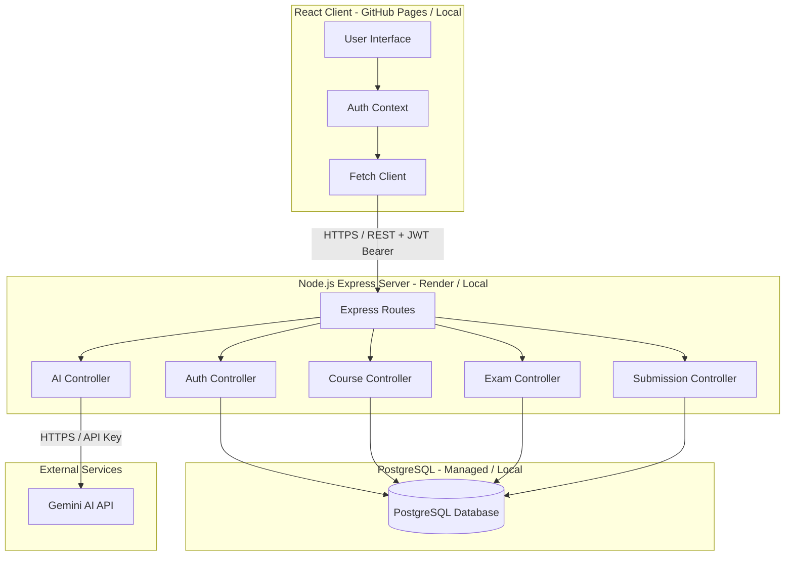
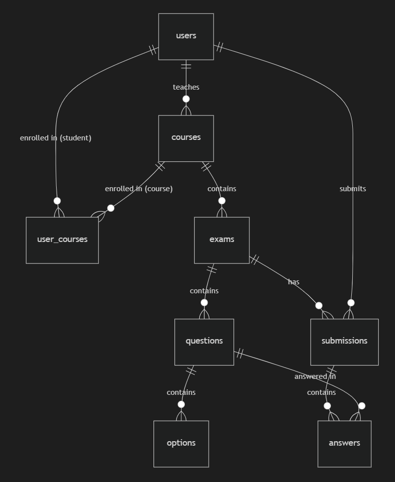

# 🎓 Full-Stack Exam Management System (LMS)

A robust, enterprise-grade Learning Management System (LMS) built to facilitate secure, timed exam creation, dynamic taking, and comprehensive grading workflows.

[](https://react.dev/)
[](https://nodejs.org/)
[](https://expressjs.com/)
[](https://www.postgresql.org/)
[](https://vite.dev/)
[](https://jwt.io/)

---

## 🌐 Live Deployments

- [Github Pages Deployment](https://nashd31.github.io/ExamApp/)
- [Render Deployment](https://examapp-2k27.onrender.com)

---

## ✨ Key Features

### 👨‍🏫 Teacher Dashboard
* **Course Administration:** Create new courses, generate unique enrollment codes, and manage active student registries.
* **AI Exam Architect:** Instantly generate a complete, balanced set of exam questions (points distributed to exactly 100) using a natural language prompt (e.g., "create a JavaScript closures exam with 5 multiple choice and 3 open ended") powered by Gemini AI.
* **Exam Composer:** Build detailed assessments containing multiple-choice questions (supporting both single and multi-select answers) or open-ended essay questions.
* **Assessment Controls:** Configure strict time limits (duration in minutes), set minimum passing criteria, and schedule release windows.
* **Manual & Auto Grading:** Auto-grade multiple-choice responses instantaneously. Grade open-ended answers manually with custom scores and detailed text comments.
* **Grade Release Control:** Keep exam scores hidden until grading is fully finalized, then publish all grades with a single click.
* **Analytics Center:** View class statistics, average scores, pass/fail ratios, and grade distribution charts.

### 🧑‍🎓 Student Portal
* **Course Enrollment:** Search and join courses using unique codes provided by teachers.
* **Focused Exam Environment:** Sit for exams in a distraction-free layout featuring a live, persistent countdown timer.
* **Auto-Submission Safeguard:** Automatically saves and submits exam progress if the countdown timer expires.
* **Detailed Feedback & History:** Browse all completed exams, view grades, review correct answers, and read teacher feedback notes.

### 🛡 Security & Customization
* **JWT-Based Authentication:** Clean state management and route security handled on both frontend route guards and backend middleware.
* **Role-Based Routing:** Strict segregation between Student and Teacher privileges.
* **Custom Profile Themes:** Personalize user experiences with custom avatar pickers and responsive UI color themes.

---

## 🚀 Production Highlights
* **🤖 AI Exam Architect (Gemini AI Integration):** Empowers teachers to draft custom exam content instantaneously using raw natural language prompts (e.g., "create a CSS layouts test with 3 multiple choice and 2 essay questions"). Our backend routes these queries to Gemini, returning structured schemas with points balanced precisely to a 100-point total.
* **🔁 Automated CI/CD Pipelines:** Outfitted with an automated GitHub Actions workflow that executes validation tests, verifies project builds, and compiles + publishes production builds to **GitHub Pages** seamlessly upon every merge or push to the `main` branch.

---

## 🏗 System Architecture

The application adopts a decoupled client-server architecture. The React frontend interacts with the Node.js/Express backend through a secure RESTful API, with PostgreSQL acting as the central transactional database.



---

## 📊 Database Schema

The relational schema is optimized with specific indexes for quick queries during exam taking and grading.



---

* **`users`**: Stores user authentication credentials, names, roles (`student`, `teacher`), and theme/avatar preferences.
* **`courses`**: Tracks academic courses managed by teachers.
* **`user_courses`**: Junction table mapping enrolled students to their respective courses.
* **`exams`**: Holds test parameters such as passing grade, duration, dates, and grading state.
* **`questions`**: Defines each exam's queries (either multiple-choice or open-ended) and point weights.
* **`options`**: Enumerates options for multiple-choice questions.
* **`submissions`**: Tracks individual student exam sittings, total scored points, and grading statuses (`submitted` or `graded`).
* **`answers`**: Stores the student's selected options or text responses, along with teacher grades/notes.

---

## 🛣 API Endpoints Reference

### 🔐 Authentication (`/api/auth`)
| Method | Endpoint | Access | Description |
| :--- | :--- | :--- | :--- |
| `POST` | `/api/auth/register` | Public | Registers a new student or teacher profile |
| `POST` | `/api/auth/login` | Public | Authenticates credentials and returns a JWT token |
| `PUT` | `/api/auth/profile/:id` | Private (Auth) | Updates user profile settings (name / avatar / theme) |

### 📚 Course Operations (`/api/courses`)
| Method | Endpoint | Access | Description |
| :--- | :--- | :--- | :--- |
| `GET` | `/api/courses` | Private (Auth) | Lists all active courses in the system |
| `GET` | `/api/courses/student/:studentId` | Private (Auth) | Retrieves courses enrolled by a specific student |
| `POST` | `/api/courses/enroll` | Private (Auth) | Enrolls a student using a unique course code |
| `DELETE` | `/api/courses/:courseId/student/:studentId` | Private (Auth) | Unenrolls a student from a course |
| `GET` | `/api/courses/teacher/:teacherId` | Private (Auth) | Retrieves courses taught by a specific teacher |
| `POST` | `/api/courses` | Private (Teacher) | Creates a new course |
| `DELETE` | `/api/courses/:id` | Private (Teacher) | Deletes a course |

### 📝 Exam Management (`/api/exams`)
| Method | Endpoint | Access | Description |
| :--- | :--- | :--- | :--- |
| `GET` | `/api/exams` | Private (Auth) | Lists exams, tailoring visibility based on role |
| `GET` | `/api/exams/:id` | Private (Auth) | Retrieves detailed exam info with questions and options |
| `POST` | `/api/exams` | Private (Teacher) | Publishes a new exam |
| `PUT` | `/api/exams/:id` | Private (Teacher) | Edits/updates an existing exam's metadata/questions |
| `DELETE` | `/api/exams/:id` | Private (Teacher) | Removes an exam permanently |

### 📤 Submissions & Grading (`/api/submissions`)
| Method | Endpoint | Access | Description |
| :--- | :--- | :--- | :--- |
| `POST` | `/api/submissions` | Private (Student) | Submits answers for a completed exam |
| `GET` | `/api/submissions/mine` | Private (Student) | Lists all exams submitted by the logged-in student |
| `GET` | `/api/submissions/student/:studentName` | Private (Auth) | Backwards compatibility endpoint for student submissions |
| `GET` | `/api/submissions/exam/:examId` | Private (Teacher) | Lists all student submissions for a specific exam |
| `GET` | `/api/submissions/exam/:examId/student/:studentName` | Private (Auth) | Fetches a student's submission breakdown for a specific exam |
| `GET` | `/api/submissions/:id` | Private (Auth) | Fetches a single submission breakdown with detailed grades |
| `PUT` | `/api/submissions/:id/grade` | Private (Teacher) | Applies scores/feedback notes to student answers |

### 🤖 AI Exam Generation (`/api/ai`)
| Method | Endpoint | Access | Description |
| :--- | :--- | :--- | :--- |
| `POST` | `/api/ai/generate-exam` | Private (Teacher) | Generates complete exam questions from natural language prompts using Gemini AI |

---

## 📁 Project Structure

```
ExamApp/
├── client/                 # Frontend React application (Vite)
│   ├── public/             # Static public assets
│   ├── src/
│   │   ├── api/            # API client configurations (Fetch)
│   │   ├── components/     # Reusable layout & feature components (Navbar, Editor, etc.)
│   │   ├── context/        # Auth and Modal Context API providers
│   │   ├── hooks/          # Custom utility React hooks
│   │   ├── pages/          # Full-page application views (Dashboard, TakeExam, etc.)
│   │   ├── services/       # Service wrappers for interacting with APIs
│   │   ├── utils/          # Formatting and mathematical calculators
│   │   ├── App.jsx         # Core app container & router
│   │   ├── index.css       # Global styling overrides
│   │   └── main.jsx        # App mounting configuration
│   ├── package.json
│   └── vite.config.js
│
└── server/                 # Backend Node.js Express server
    ├── config/             # DB pools and environment configuration
    ├── controllers/        # Request handlers & application logic
    ├── data/               # Mock data blueprints for database seeding
    ├── db/                 # DB schema initialization DDL and seeding scripts
    │   ├── schema.sql      # DDL database schema definitions
    │   └── seed.js         # JavaScript seeder engine
    ├── middleware/         # Security guards and error handlers
    ├── routes/             # REST route mount mappings
    ├── server.js           # Server application bootstrapper
    └── package.json
```

---

## 🐳 Local Simulation with Docker

To simulate the entire system (Database, Backend, and Frontend) locally using Docker:

1. **Configure your API Key**: Create a `.env` file in the project root directory (same folder as `docker-compose.yml`) and add your API key:
   ```env
   GEMINI_API_KEY=your_gemini_api_key_here
   ```
2. **Build and Run**:
   ```bash
   docker compose up --build
   ```
3. **Seed the Database**:
   With the containers running, seed the PostgreSQL database by running:
   ```bash
   docker exec -it examapp_server npm run seed
   ```
4. **Access Ports**:
   - **Frontend UI**: `http://localhost:8080`
   - **Backend REST API**: `http://localhost:5000`